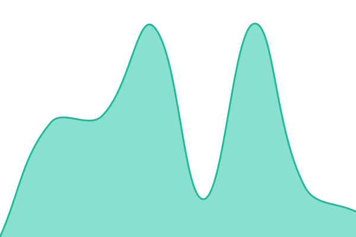
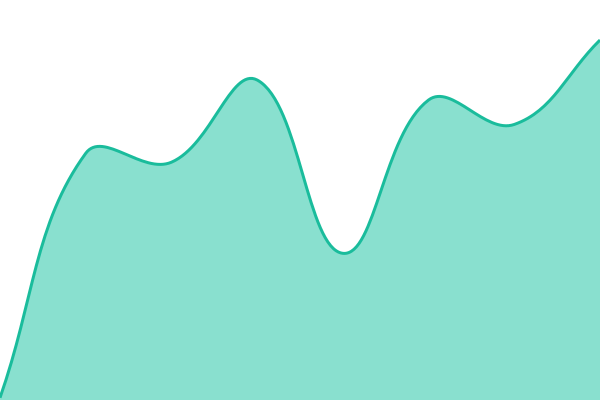

# UniClipboard Status

This repository contains the open-source uptime monitor and status page for [UniClipboard](https://status.uniclipboard.app), powered by [Upptime](https://github.com/upptime/upptime).

With [Upptime](https://upptime.js.org), you can get your own unlimited and free uptime monitor and status page, powered entirely by a GitHub repository. We use [Issues](https://github.com/UniClipboard/uc-status/issues) as incident reports, [Actions](https://github.com/UniClipboard/uc-status/actions) as uptime monitors, and [Pages](https://status.uniclipboard.app) for the status page.

<!--start: status pages-->
<!-- This summary is generated by Upptime (https://github.com/upptime/upptime) -->
<!-- Do not edit this manually, your changes will be overwritten -->
<!-- prettier-ignore -->
| URL | Status | History | Response Time | Uptime |
| --- | ------ | ------- | ------------- | ------ |
|  [Website](https://www.uniclipboard.app) | 🟩 Up | [website.yml](https://github.com/UniClipboard/uc-status/commits/HEAD/history/website.yml) | 

 1869ms
     
 | 

<a href="https://status.uniclipboard.app/history/website">100.00%</a>
    

|  [Downloads](https://release.uniclipboard.app/health) | 🟩 Up | [downloads.yml](https://github.com/UniClipboard/uc-status/commits/HEAD/history/downloads.yml) | 

 129ms
     
 | 

<a href="https://status.uniclipboard.app/history/downloads">100.00%</a>
    

|  [Relay Server](https://relay.uniclipboard.app) | 🟩 Up | [relay-server.yml](https://github.com/UniClipboard/uc-status/commits/HEAD/history/relay-server.yml) | 

 248ms
     
 | 

<a href="https://status.uniclipboard.app/history/relay-server">100.00%</a>
    

|  [Rendezvous Server](https://rendezvous.uniclipboard.app/healthz) | 🟩 Up | [rendezvous-server.yml](https://github.com/UniClipboard/uc-status/commits/HEAD/history/rendezvous-server.yml) | 

 143ms
     
 | 

<a href="https://status.uniclipboard.app/history/rendezvous-server">100.00%</a>
    

<!--end: status pages-->

## License

- Code: [MIT](./LICENSE)
- Status page template: [Upptime](https://github.com/upptime/upptime) by Anand Chowdhary
